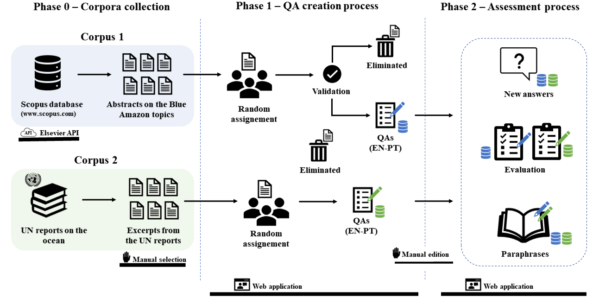

# *Pirá*: A Bilingual Portuguese-English Dataset for Question-Answering about the Ocean
*Pirá* [link] is a manually-constructed dataset of questions and answers about the ocean and the Brazilian coast designed for reading comprehension. 

This dataset contains 2261 QA sets, as well as the texts associated with them. Each QA set contais up to four elements: a question in Portuguese and in English, and an answer in Portuguese and in English. Around 90% of the QA sets also contain manual evaluations.

Pirá is, to the best of our knowledge, the first QA dataset with supporting texts in Portuguese, and, perhaps more importantly, the first bilingual QA dataset that includes Portuguese as one of the languages. Pirá is also the first QA dataset in Portuguese with unanswerable questions so as to allow the study of answer triggering; finally, it is the first QA dataset that deals with scientific knowledge about the ocean, climate change, and marine biodiversity.

# Methodology
The dataset generation process is depicted above. Two different corpora of texts were collected: abstracts of scientific papers about the Brazilian coast, and small excerpts of two books about the ocean organized by the United Nations ([World Ocean Assessment I](https://www.un.org/regularprocess/content/first-world-ocean-assessment) and [World Ocean Assessment II](https://www.un.org/regularprocess/woa2launch)). Undergraduate and graduate volunteers then created questions based on these texts, both in English and Portuguese. Participants were instructed to produce questions that could be answered with the use of the texts and no other source of information. In a second step, the same volunteers assessed these QA sets in a number of ways. They were asked to: i) answer the question in both languages without having access to the original answer; ii) assess the whole original QA set (the questions and respective answers) according to a number of aspects; and iii) paraphrase the original question.



Here is example of QA set from Pirá:

```
{
    "id_qa": "B2142",
    "corpus": 2,
    "question_en_origin": "What are the proportion of men and women employed in the fishery sector worlwide?",
    "question_pt_origin": "Qual é a proporção de homens e mulheres empregados no setor pesqueiro em todo o mundo?",
    "question_en_paraphase": "Which share of the fishery sector workers of the world are women?",
    "question_pt_paraphase": "Qual parcela dos trabalhadores do setor da pesca no mundo são mulheres?",
    "answer_en_origin": "85 per cent men and 15 per cent women.",
    "answer_pt_origin": "85 por cento homens e 15 por cento mulheres.",
    "answer_en_validate": "It is estimated that more than fifteen per cent of the fishing sector workers are women.",
    "answer_pt_validate": "Estima-se que mais de quinze por cento dos trabalhadores do setor da pesca são mulheres.",
    "eid_article_scopus": "",
    "text_excerpts_un_reports": "<h1>Distribution of ocean benefits and disbenefits</h1> \n\n<h2>Developments in employment and income from fisheries and aquaculture</h2> \n\n<p>The global harvest of marine capture fisheries has expanded rapidly since the early 1950s and is currently estimated to be about 80 million tons a year. That harvest is estimated to have a first (gross) value on the order of 113 billion dollars. Although it is difficult to produce accurate employment statistics, estimates using a fairly narrow definition of employment have put the figure of those employed in fisheries and aquaculture at 58.3 million people (4.4 per cent of the estimated total of economically active people), of which 84 per cent are in Asia and 10 per cent in Africa. Women are estimated to account for more than 15 per cent of people employed in the fishery sector. Other estimates, probably taking into account a wider definition of employment, suggest that capture fisheries provide direct and indirect employment for at least 120 million persons worldwide.</p> \n\n<p>Small-scale fisheries employ more than 90 per cent of the world’s capture fishermen and fish workers, about half of whom are women. When all dependants of those taking full- or part-time employment in the full value chain and support industries (boatbuilding, gear construction, etc.) of fisheries and aquaculture are included, one estimate concludes that between 660 and 820 million persons have some economic or livelihood dependence on fish capture and culture and the subsequent direct value chain. No sound information appears to be available on the levels of death and injury of those engaged in capture fishing or aquaculture, but capture fishing is commonly characterized as a dangerous occupation.</p> \n\n<p>Over time, a striking shift has occurred in the operation and location of capture fisheries. In the 1950s, capture fisheries were largely undertaken by developed fishing States. Since then, developing countries have increased their share. As a broad illustration, in the 1950s, the southern hemisphere accounted for no more than 8 per cent of landed values. By the last decade, the southern hemisphere’s share had risen to 20 per cent. In 2012, international trade represented 37 per cent of the total fish production in value, with a total export value of 129 billion dollars, of which 70 billion dollars (58 per cent) was exports by developing countries.</p> \n\n<p>Aquaculture is responsible for the bulk of the production of seaweeds. Worldwide, reports show that 24.9 million tons was produced in 2012, valued at about 6 billion dollars. In addition, about 1 million tons of wild seaweed were harvested. Few data were found on international trade in seaweeds, but their culture is concentrated in countries where consumption of seaweeds is high.</p>",
    "question_generic": false,
    "answer_in_text": true,
    "answer_difficulty": 1,
    "question_meaningful": 5,
    "answer_equivalent": 5,
    "question_type": "None of the above"
  }
  ```

# Dataset description
*Pirá* is available in three formats: [JSON](https://github.com/C4AI/Pira/tree/main/JSON), [CSV](https://github.com/C4AI/Pira/tree/main/CSV), and [XLSX](https://github.com/C4AI/Pira/tree/main/XLSX).

It has three versions: *Pirá-F* (filtered), *Pirá-T* (triggering), and *Pirá-C* (complete).

*Pirá-F* includes only QA sets that volunteers indicated as not generic, that could be answered with only the information provided by the text, and moreover that volunteers agreed (4) or strongly agreed (5) that made sense. When volunteers reported in Phase 2 that their answer did not coincide with the original one (i.e., 1-2 in the Likert scale for “Your answer and the original answer are equivalent”), we excluded the new answer from the dataset. Finally, we also included the paraphrases. The dataset contains up to four possible combinations of QA sets: original question, original answer; original question, new answer; paraphrase, original answer; paraphrase, new answer.

*Pirá-T* is the answer-triggering version of the dataset. It includes all QA sets generated in Phases 1 and 2 (meaningful and meaningless, contextualized and non-contextualized, answered by the text only or not). As for *Parí-F*, we also excluded questions that were assessed with one or two points for the statement “Your answer and the original answer are equivalent”. In addition, the answers (original e new) for questions that volunteers regarded meaningless (1-2 in the Likert scale for “The question makes sense”) were filled with “ ” (blank value). In datasets that every question possess an answer, models can always guess an answer (and sometimes be right just by luck). Instead, by allowing some questions not to have an answer, models are required to learn when they are able to answer a given question, a task known as “answer triggering” (which is getting more important in QA datasets).

For the sake of completeness, we also make available *Pirá-C*, with all the questions and answers produced in the generation and assessment phases.

| Version  |  #QA sets  |
| ------------------- | ------------------- |
|  *Pirá-F* |  1347 |
|  *Pirá-T* |  2070 |
|  *Pirá-C* |  2272 |

# Web application
As part of the process of creating Pirá, we developed a web application for conducting the two phases of the experiment: QA creation and evaluation.

The code for the two parts of the application can be found in [data-set-builder](https://github.com/C4AI/data-set-builder) and [data-set-validator](https://github.com/C4AI/data-set-validator).

# Citation
If you use or discuss this dataset in your work, please cite it as follows:

```
@inproceedings{x,
    title = "{Pirá: A Bilingual Portuguese-English Dataset for Question-Answering about the Ocean}",
    author = "x",
    booktitle = "x",
    year = "2021"
}
```

If you use our dataset, please get in contact with us, so we can reference it here.

# License
*Pirá* dataset is licensed under [CC BY 4.0](https://creativecommons.org/licenses/by/4.0/).
